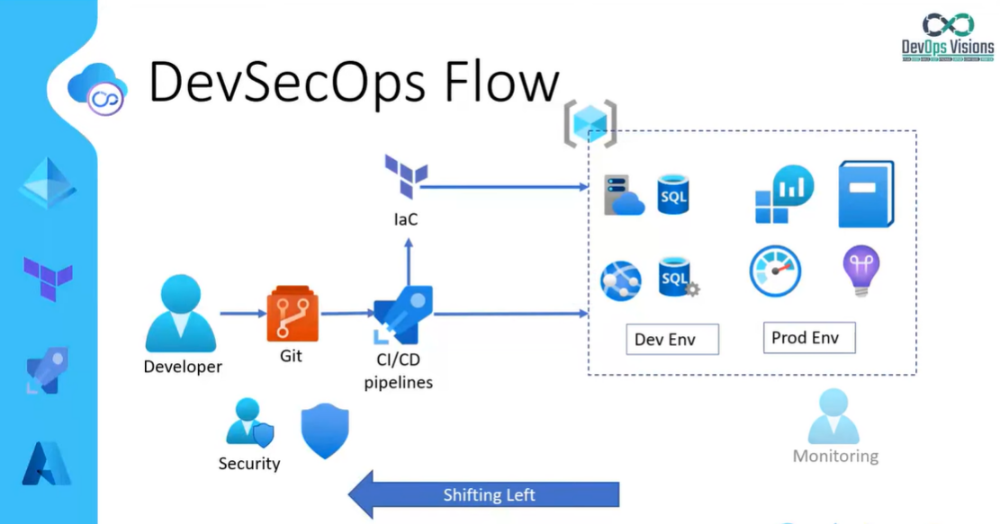

README.md

# Securely Deploying Apps with Microsoft Entra ID and Terraform

## Brief Description

This project provides a solution for securely deploying applications using Azure Active Directory (AAD) and Terraform. By eliminating the need for secrets, it strengthens security practices within a DevSecOps workflow.

The project utilizes several technologies including Azure Entra ID, Terraform, Azure Pipeline, and Azure Cloud. The key feature of this project is the use of AAD, which provides a more secure alternative to using secrets in DevSecOps.

1. [Introduction](#introduction)
2. [Services and Tools Used](#services-and-tools-used)
3. [DevSecOps Flow](#devsecops-flow)
4. [Infrastructure as Code (IaC)](#infrastructure-as-code-iac)
5. [Identity and Access Management (IAM)](#identity-and-access-management-iam)
6. [Everything as Code (EaC)](#everything-as-code-eac)
7. [Terraform Best Practices](#terraform-best-practices)
8. [Code Breakdown](#code-breakdown)
9. [Deployment Pipeline Flow](#deployment-pipeline-flow)
10. [Pre-requisites for Demo](#pre-requisites-for-demo)
11. [Demo Highlights](#demo-highlights)
12. [Conclusion](#conclusion)

## Introduction
This project is a manifestation of the Agile methodology and the DevOps principle, “Shift Left”. The core idea of “Shift Left” is to incorporate security aspects at an early stage of the development process.

The project provides a secure solution for application deployment using Microsoft Entra ID and Terraform. The unique feature of this solution is the elimination of the need for secrets, which significantly improves the security practices within a DevSecOps workflow.

By implementing this solution, we are effectively putting the “Shift Left” principle into action, thereby enhancing the overall security posture of our development process. This aligns with our commitment to adopt and promote best practices in DevSecOps.

## Services and Tools Used
* **Cloud Platform:** Microsoft Azure
* **Identity and Access Management:** Microsoft Entra ID
* **Infrastructure as Code:** Terraform
* **CI/CD:** Azure Pipelines

## DevSecOps Flow

The project adopts the "Shift Left" principle, integrating security checks earlier in the development process. It includes the implementation of security scans and vulnerability checks, enhancing the overall security posture of the pipeline.

## Infrastructure as Code (IaC)

The project utilizes Infrastructure as Code (IaC) tools like Terraform for automating deployment, promoting consistency and efficiency in the development process.

## Identity and Access Management (IAM)

The project leverages Azure Active Directory (AAD) for managing user access and permissions for resources. It supports authentication, authorization, multi-factor authentication (MFA), and managed identities.

## Everything as Code (EaC)

The project adopts the Everything as Code (EaC) principle, offering benefits such as consistency, scalability, auditability, and reusability. It uses Terraform, a popular IaC tool for infrastructure provisioning.

## Terraform Best Practices

TThe project adheres to Terraform’s best practices, which include avoiding hardcoding variables, using consistent naming conventions, leveraging data sources to access external objects, and tagging resources. Tagging resources allows for efficient management and organization of resources, making it easier to allocate costs, manage resource lifecycles, and implement compliance and security protocols. By following these practices, we ensure a structured, scalable, and efficient infrastructure management.

## Code Breakdown

The codebase includes configurations for CLI arguments passed from the deployment pipeline, environment arguments for different environments (Dev, Production, etc.), local variables, and common tags. It also includes back-end configuration with a storage account and container for Terraform state files, and resource naming conventions.

The `main.tf` file defines infrastructure resources like resource groups, storage accounts, and App Services. It also handles authentication using Azure Active Directory identity.

## Deployment Pipeline Flow

The deployment pipeline, following the principles of Trunk-Based Development, triggers deployments based on code changes (e.g., branch changes). In a Trunk-Based Development model, all developers work on a single branch with open access, often referred to as ‘trunk’ or ‘main’. This approach encourages frequent commits, short-lived feature branches, and emphasizes the importance of a robust testing suite.

The pipeline uses deployment groups with conditions for different environments and utilizes Terraform tasks for infrastructure creation and management. It leverages Terraform outputs as variables for subsequent tasks. Additionally, a Service Principal runs SQL queries to grant access to developers. This approach ensures a streamlined, efficient, and collaborative development process.

## Pre-requisites for Demo

- Service Principal configured in Azure DevOps.
- Azure Container Registry service connection established.
- Back-end resources like storage account and container provisioned.
- Groups and permissions configured in Microsoft Entra ID.

## Demo Highlights

The demo showcases a secure deployment triggered on the main branch, with a Docker container being built and deployed. Terraform creates the infrastructure and deploys the application, and a Service Principal runs SQL queries to grant access to developers. The demo also includes a demonstration of application functionality and access control.

## Conclusion

The project emphasizes secure deployment using Azure Active Directory identity and highlights the importance of ongoing feedback and improvement within the deployment process. It serves as a practical example of implementing DevSecOps principles in a real-world scenario.

